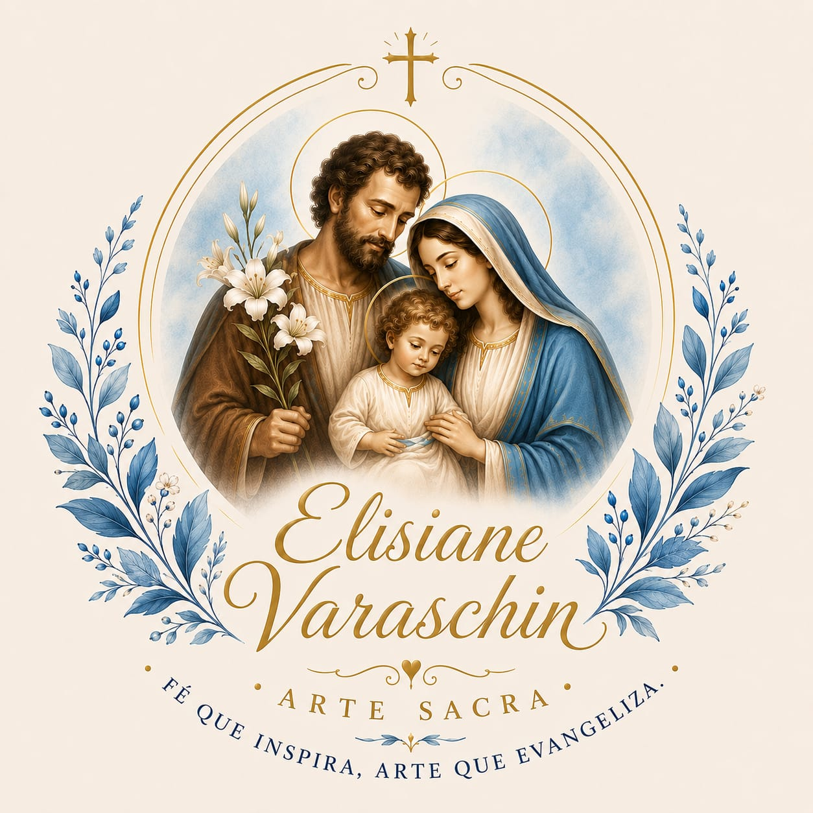
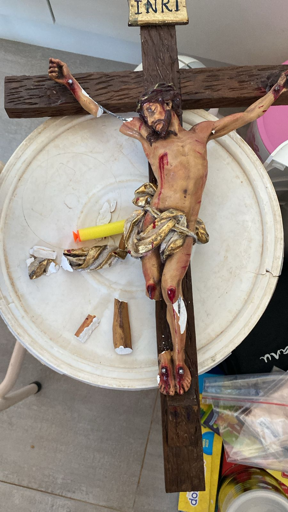
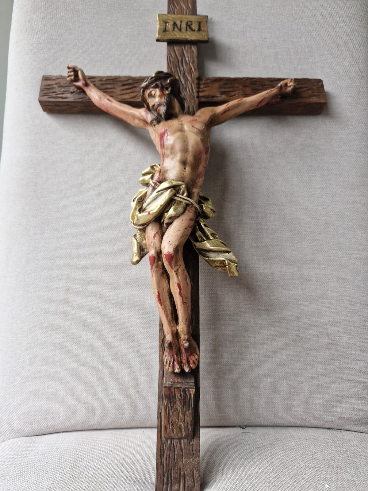
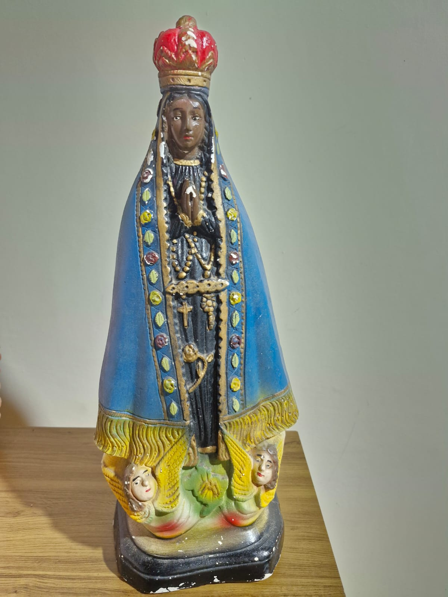
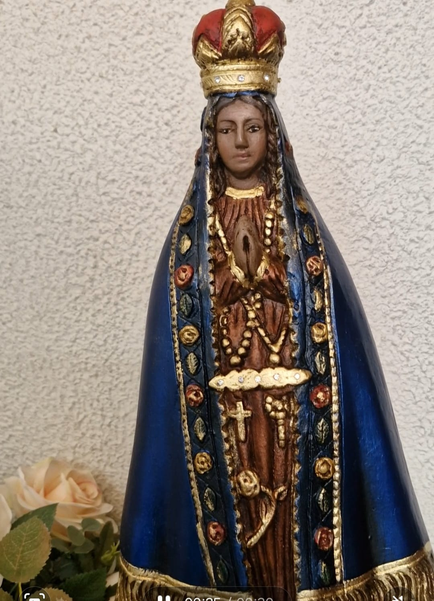

<div align="center">
  

  # Elisiane Varaschin — Restauração de Imagens Sacras

  *"Preservando símbolos de fé com dedicação, respeito e sensibilidade."*

  [](index.html)
  [](css/styles.css)
  [](js/script.js)
  [](#)
</div>

---

## Sobre o projeto

Site institucional de página única (*one-page*) criado para divulgar o trabalho de **Elisiane Varaschin**, restauradora de imagens religiosas. O objetivo é apresentar o ateliê, exibir o resultado de restaurações reais através de um comparador interativo de "antes e depois" e facilitar o contato via WhatsApp e Instagram.

Construído com **HTML5 + CSS3 + JavaScript puro**, sem frameworks, bibliotecas ou etapa de build — basta abrir o `index.html` no navegador.

## Prévia

<div align="center">
  <table>
    <tr>
      <td align="center"><b>Cristo Crucificado</b></td>
      <td align="center"><b>Nossa Senhora Aparecida</b></td>
    </tr>
    <tr>
      <td> ➜ </td>
      <td> ➜ </td>
    </tr>
  </table>
</div>

## Funcionalidades

- **Comparador antes/depois** — divisor arrastável (mouse, toque ou teclado) construído com `clip-path`, sem dependências externas.
- **Lightbox** — clique em qualquer restauração para ampliá-la em um modal acessível, com foco devolvido ao elemento de origem ao fechar.
- **Menu responsivo** — navegação com toggle mobile, fecha ao clicar em um link ou pressionar `Esc`.
- **Animações de entrada** — elementos surgem suavemente ao rolar a página, via `IntersectionObserver`.
- **Acessibilidade** — skip link, `aria-label`/`aria-expanded`/`role="slider"`, suporte a `prefers-reduced-motion`.
- **SEO pronto** — meta tags, Open Graph e dados estruturados `schema.org/LocalBusiness`.
- **Contato direto** — botões para WhatsApp e Instagram em toda a página.

## Estrutura do projeto

```
├── index.html          # marcação e conteúdo do site
├── css/
│   └── styles.css      # paleta, layout e componentes (mobile-first, BEM)
├── js/
│   └── script.js       # menu, reveal on scroll, comparador e lightbox
└── assets/              # fotos, logo e favicon
```

## Como rodar localmente

Não há build nem dependências — é só abrir o arquivo:

```bash
# opção 1: abrir direto no navegador
open index.html      # macOS
start index.html      # Windows

# opção 2: servir localmente (recomendado para testar tudo corretamente)
python -m http.server 8080
# depois acesse http://localhost:8080
```

## Contato

- **WhatsApp:** [(43) 99875-2725](https://wa.me/5543998752725)
- **Instagram:** [@elisiane.consultora](https://instagram.com/elisiane.consultora)

---

<div align="center">
  <sub>Desenvolvido por <strong>Diogo José Varaschin de Oliveira</strong></sub>
</div>
